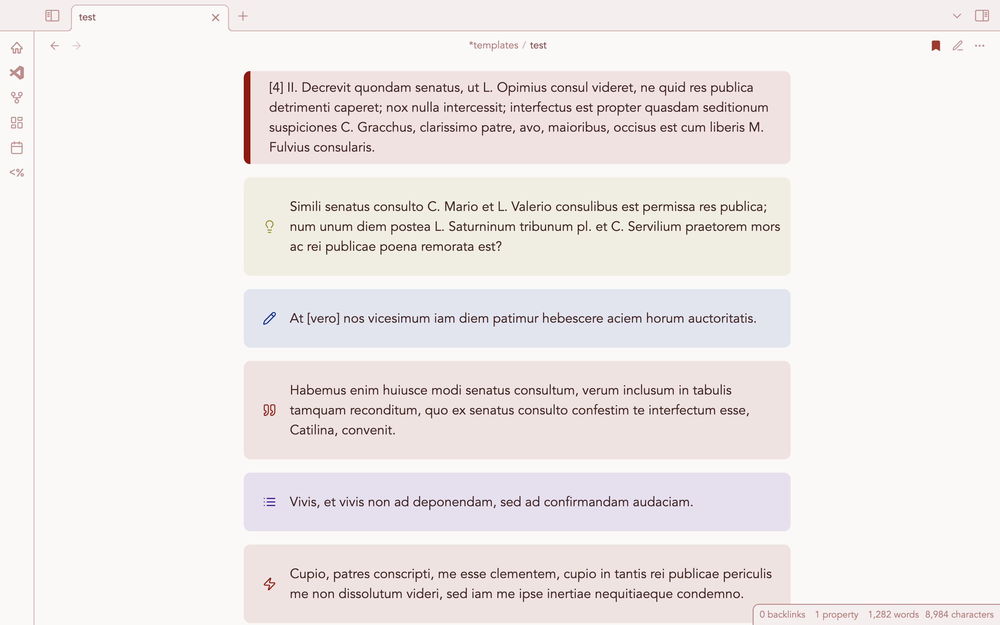
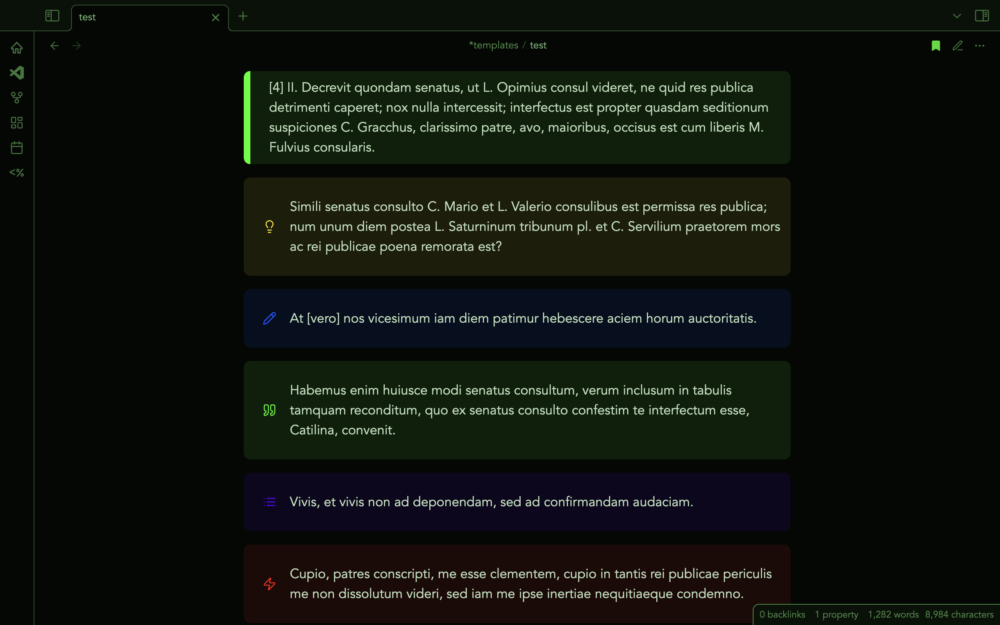

A theme built to adjust to a chosen accent color.

The Camenae were the native Italic goddesses Livius Andronicus chose to represent a localized version of the Greek Muses in his Latin translation of the *Odyssey*. This theme was primarily an attempt to find how far could I push Obsidian's CSS variables to make a theme accomodate a chosen accent color. The answer is, in fact, pretty far: all colors, including colors with defined hues, are responsive to the accent color. 